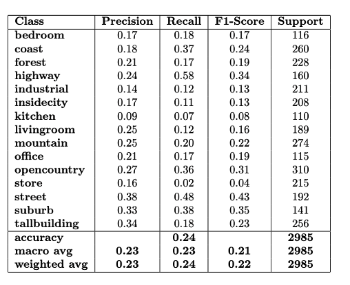

# Scene Recognition with Bag of Words and Tiny Image Representation 🌄

This project implements two different methods for scene recognition: **Bag of Words (BoW)** using **SIFT** feature extraction and **Tiny Image Representation**. Both methods are used with **KNN (k-Nearest Neighbors)** classification to recognize scenes from the **15 Scene Dataset**.

## Project Overview 🎯

The project explores two approaches:

1. **Bag of Words (BoW)**: Images are represented by a histogram of features extracted using **SIFT** (Scale-Invariant Feature Transform). These features are clustered into "visual words" using **k-means clustering**, and the classification is done using the KNN algorithm.

2. **Tiny Image Representation**: Images are resized to a smaller resolution, maintaining the core structure, which simplifies the feature extraction and classification process. The Bag of Words model is then applied on these tiny images, and classification is done using KNN.

Both methods are evaluated to determine which one provides better performance in terms of computational cost and accuracy. 📊

## Data Set 🖼️

The model works with a **15 Scene Dataset**, which includes the following categories:

- Bedroom 🛏️
- Coast 🌊
- Forest 🌲
- Highway 🛣️
- Industrial 🏭
- InsideCity 🏙️
- Kitchen 🍽️
- LivingRoom 🛋️
- Mountain 🏔️
- Office 💻
- OpenCountry 🏞️
- Store 🏬
- Street 🚶‍♂️
- Suburb 🏘️
- TallBuilding 🏢

### Sample Images

Here are a few examples of images from the dataset:

| Category | Image | Category | Image |
| --- | --- | --- | --- |
| Bedroom |  | Kitchen |  |
| Coast |  | Mountain |  |
| Forest |  | Office |  |
| Highway |  | Store |  |

## Feature Extraction: SIFT 🔍

We start by extracting **SIFT** features from the images. These keypoints are distinctive and invariant to scaling, rotation, and small changes in viewpoint. These features are then clustered into "visual words" using a **k-means clustering** algorithm, forming the basis for the Bag of Words representation.

## KNN Classification 🏆

Once we have the visual words, we use the **KNN algorithm** to classify images based on their similarity to other labeled images. The model compares the visual words of an input image to those of the training images and assigns the label of the closest class.

### Example Classification Results

Here are some examples of the classification results:

- **True Positives (TP):** Correctly classified images. ✅
- **False Positives (FP):** Incorrectly classified images. ❌
- **False Negatives (FN):** Missed images. 🚫

| Category | TP | FP | FN |
| --- | --- | --- | --- |
| Bedroom |  |  |  |
| Kitchen |  |  |  |
| Coast |  |  |  |

## Performance Evaluation 📈

We evaluate the model's performance using accuracy and other metrics. Here is a summary of the evaluation results:

## Code Overview 💻

### Main Files

- **`create_bag_sift.py`**: Extracts SIFT features and creates the Bag of Words model.
- **`knn.py`**: Implements the KNN algorithm for classification.
- **`evaluation.py`**: Evaluates the classification performance of the model.
- **`load_image.py`**: Loads and pre-processes the images for feature extraction.
- **`main.py`**: Orchestrates the entire workflow from loading data to evaluation.

## Tiny Image Representation for Scene Recognition 🌟

This project demonstrates how **Tiny Image** representation can be used to efficiently classify scenes using the **Bag of Words** approach combined with **KNN** classification. By reducing the dimensionality of images while retaining essential features, the model can process images quickly and effectively.

### Sample Tiny Images

Here are a few tiny images from the dataset:

| Category | Image | Category | Image |
| --- | --- | --- | --- |
| Bedroom |  | Kitchen |  |
| Coast |  | Mountain |  |
| Forest |  | Office |  |

## Tiny Image Representation 🔎

Tiny images are generated by resizing the original images into a smaller resolution while retaining the core visual structure. This simplification enables faster processing and more efficient classification. Below are a few tiny images for illustration:

## Feature Extraction and Classification 🛠️

Tiny images are first used to extract features, which are then clustered into visual words using **k-means clustering**. These visual words form the vocabulary for the **Bag of Words** model. **KNN** classification is applied to classify the images based on their feature histograms.

### Example Classification Results

The classification results, including **True Positives (TP)**, **False Positives (FP)**, and **False Negatives (FN)**, are shown below:

| Category | TP | FP | FN |
| --- | --- | --- | --- |
| Bedroom |  |  |  |
| Kitchen |  |  |  |
| Coast |  |  |  |

## Code Overview 💡

### Main Files

- **`create_bag_sift.py`**: Creates the Bag of Words model from tiny images.
- **`knn.py`**: Classifies images using the KNN algorithm.
- **`evaluation.py`**: Evaluates classification performance.
- **`load_image.py`**: Loads and processes the tiny images for feature extraction.
- **`main.py`**: Main script for the entire workflow.

## Conclusion 🎉

Using **Tiny Image** representation significantly improves the efficiency of scene classification models. This method, combined with the Bag of Words approach, achieves a balance between performance and computational cost. The KNN algorithm further enhances the classification process, providing reliable results for scene recognition tasks. 🚀
