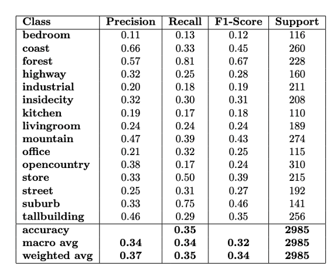

# SceneBoW 🌄
**SceneBoW** is a scene recognition project using two classical computer vision methods:
- **Bag of Words (BoW)** with **SIFT** features
- **Tiny Image Representation**

Both approaches are combined with **k-Nearest Neighbors (KNN)** classification on the **15 Scene Dataset**.
---

## 🔍 Overview

### 1. Bag of Words (BoW)
- Extract **SIFT** features from images
- Cluster features into "visual words" using **k-means**
- Represent each image as a histogram of visual words
- Classify images using **KNN**

### 2. Tiny Image Representation
- Resize images to low resolution (tiny images)
- Represent them as feature vectors
- Apply **BoW + KNN** for classification

Both methods are compared based on accuracy and computational efficiency.

---

## 🖼️ Dataset: 15 Scene Categories

Includes images from:
- Bedroom, Coast, Forest, Highway, Industrial
- InsideCity, Kitchen, LivingRoom, Mountain, Office
- OpenCountry, Store, Street, Suburb, TallBuilding

### Sample Images
| Category | Image | Category | Image |
|---------|-------|----------|-------|
| Bedroom |  | Kitchen |  |
| Coast   |    | Mountain |  |

---

## 🔧 Feature Extraction

### SIFT (Scale-Invariant Feature Transform)
- Extracts keypoints that are robust to scale and rotation
- Used for building BoW representation

### Tiny Images
- Original images are resized to fixed low-resolution
- Fast and lightweight for classification

---

## 📊 Classification with KNN

- For both BoW and Tiny Image features
- Classifies based on similarity to training samples
- Uses majority vote from `k` nearest neighbors

### Classification Results

| Category | TP | FP | FN |
|----------|----|----|----|
| Bedroom  |  |  |  |
| Kitchen  |  |  |  |

---

## 🧪 Tiny Image Results

| Category | TP | FP | FN |
|----------|----|----|----|
| Bedroom  |  |  |  |
| Kitchen  |  |  |  |

---

## 📈 Performance

Comparison of accuracy and cost between:
- BoW + KNN
- Tiny Image + KNN

---

## 📁 Main Files

| File | Description |
|------|-------------|
| `create_bag_sift.py` | Extracts SIFT features and creates BoW |
| `knn.py` | KNN classification logic |
| `evaluation.py` | Measures accuracy and performance |
| `load_image.py` | Loads and preprocesses images |
| `main.py` | Runs the full pipeline |

---

## ✅ Conclusion

**SceneBoW** demonstrates how traditional techniques like **SIFT**, **Bag of Words**, and **Tiny Images** can still be effective for image classification tasks. Combining them with **KNN** provides a simple yet interpretable baseline for scene recognition.

