## Visualization
| Category name | Sample training images | Sample true positives | False positives with true label | False negatives with wrong predicted label |
| :-----------: | :--------------------: | :-------------------: | :-----------------------------: | :----------------------------------------: |
| bedroom |  | 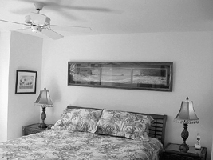 | 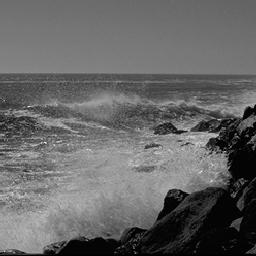 | 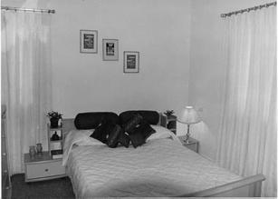 |
| coast | 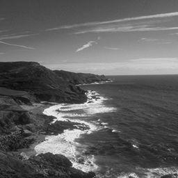 |  | 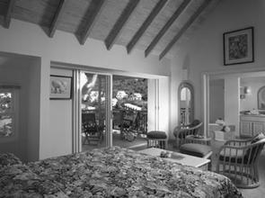 |  |
| forest | 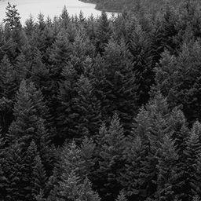 | 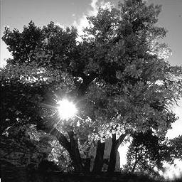 | 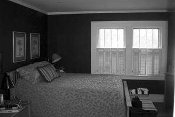 |  |
| highway | 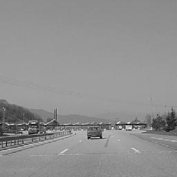 |  |  | 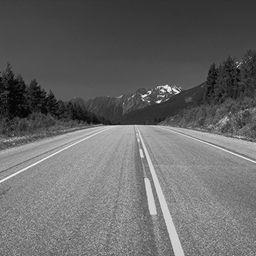 |
| insidecity | 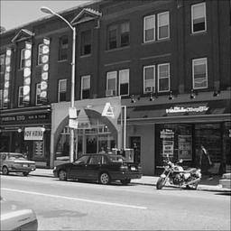 | 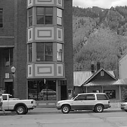 |  | 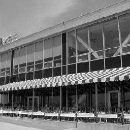 |
| industrial | 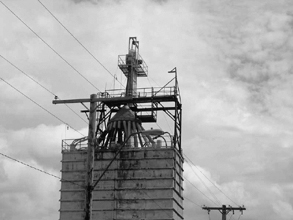 | 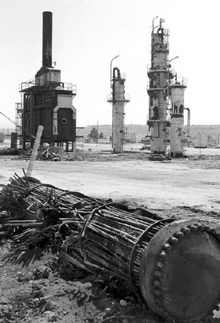 | 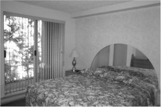 |  |
| kitchen |  | 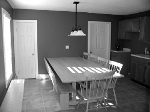 | 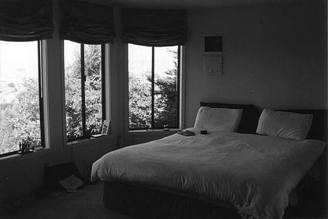 | 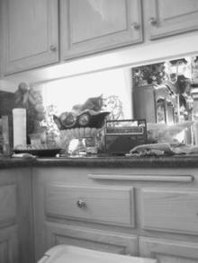 |
| livingroom | 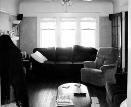 | 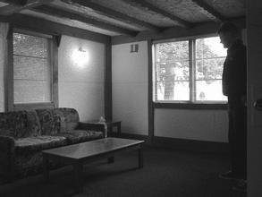 |  | 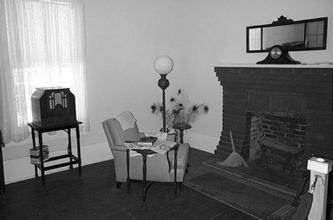 |
| mountain |  | 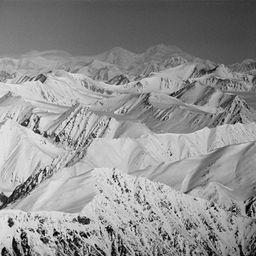 | 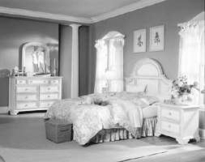 |  |
| office |  |  | 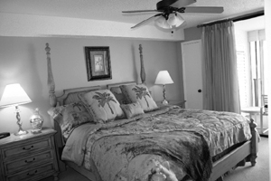 |  |
| opencountry | 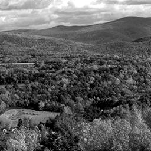 | 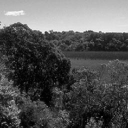 |  | 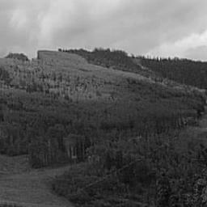 |
| street |  | 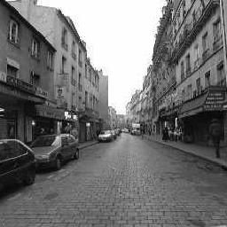 |  |  |
| suburb |  | 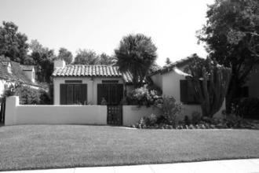 | 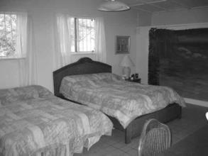 |  |
| store |  | 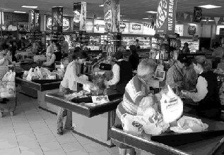 | 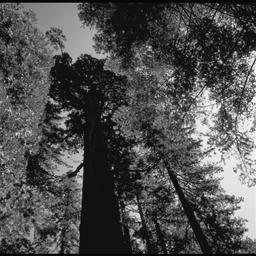 |  |
| tallbuilding |  |  | 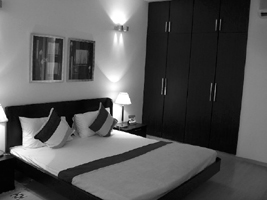 |  |
